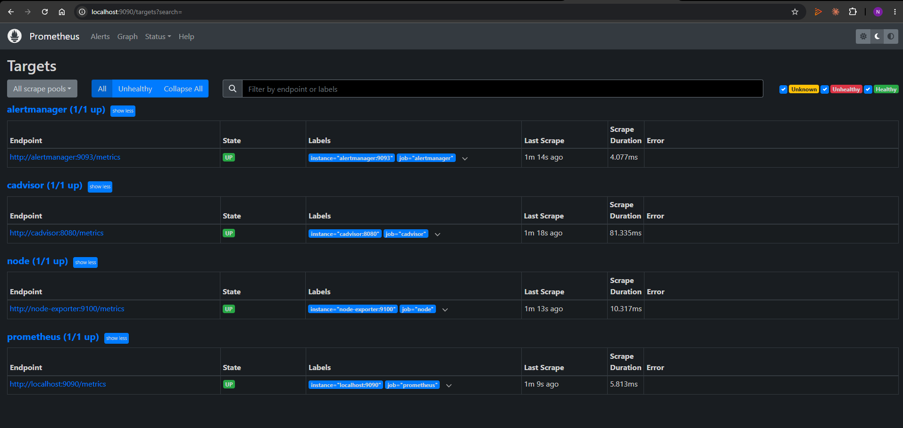
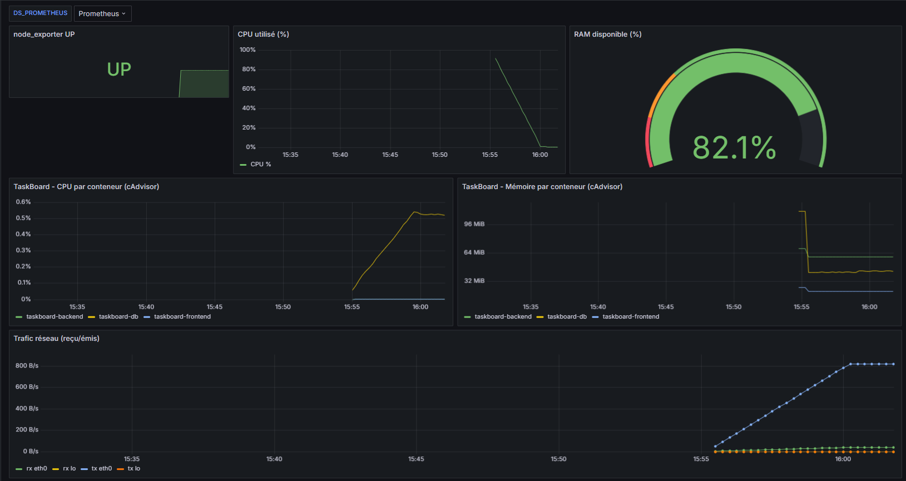
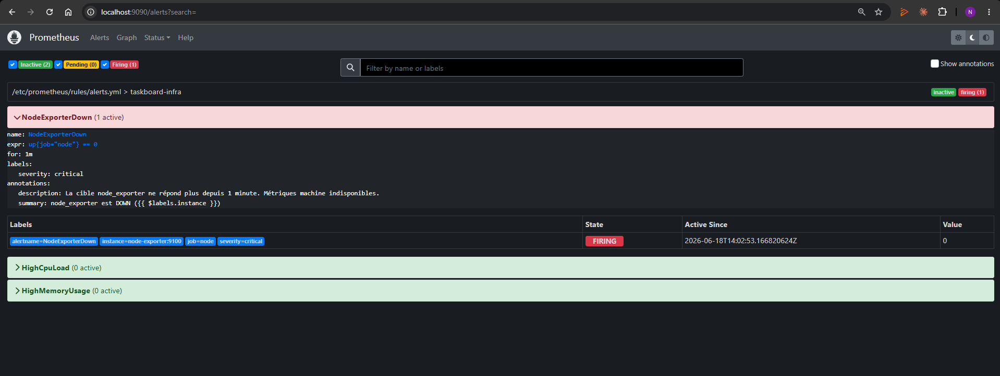
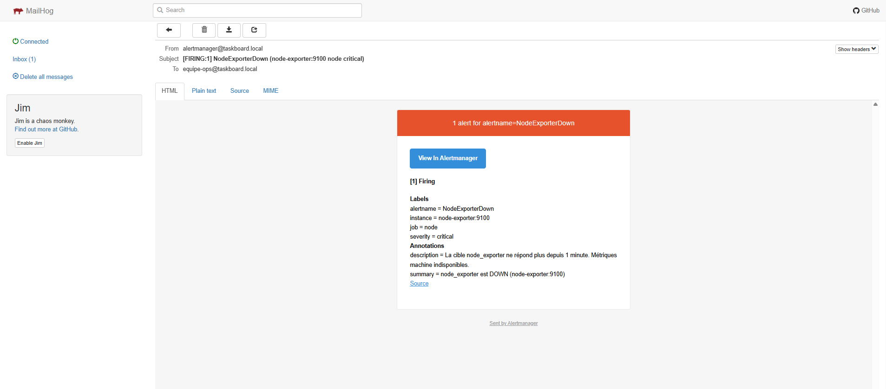
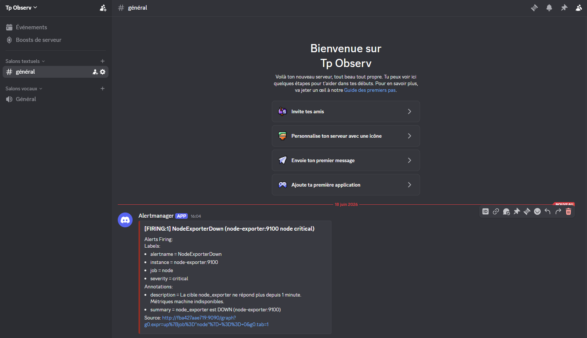
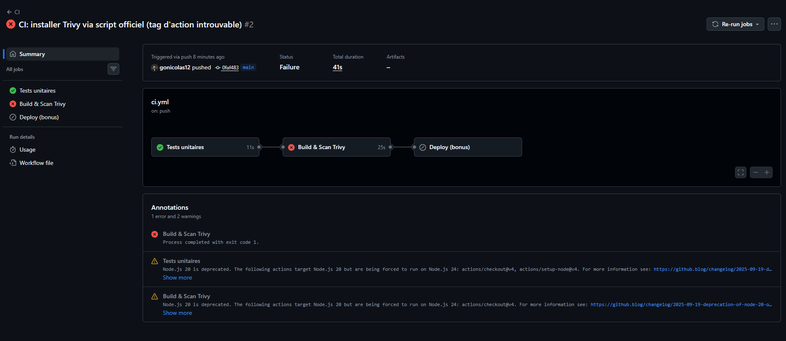
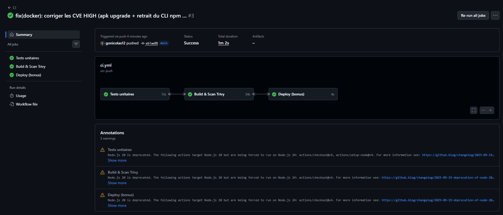

# Rapport TP — Observabilité (Grafana) & CI/CD

**Étudiant :** Nicolas GOUY
**Parcours choisi :** Docker Compose
**Dépôt :** https://github.com/gonicolas12/tp_observ · **Image :** `taskboard-api:1.0.0`

> Convertir ce fichier en PDF (1–2 pages) une fois relu.
> Sur VS Code : extension « Markdown PDF » → clic droit → *Export (pdf)*.

---

## Partie A — Stack de supervision

Chaîne : **Prometheus + node_exporter (+ cAdvisor) → Grafana → Alertmanager →
mail (MailHog) + Discord**. Tout est défini dans `monitoring/`
(`docker-compose.monitoring.yml` + configs commentées).

### A.1 — Cibles UP
Prometheus → Status → Targets : `prometheus`, `node`, `cadvisor`,
`alertmanager` tous **UP**.

### A.2 — Dashboard Grafana
Dashboard « TaskBoard - Vue d'ensemble » (provisionné automatiquement) : node
UP, CPU, jauge RAM, métriques par conteneur TaskBoard (cAdvisor), trafic réseau.

### A.3 — Alerte mail + Discord
Règle déclenchée : `NodeExporterDown` (arrêt volontaire de node_exporter).
La **même alerte** est routée par Alertmanager vers les **deux** canaux.

Mail reçu (MailHog :8025) :

Message reçu dans le salon Discord :

---

## Partie B — Pipeline CI/CD (GitHub Actions)

Fichier : `.github/workflows/ci.yml`. À chaque push : **test → build → scan
Trivy**. Le scan `trivy image --severity HIGH,CRITICAL --exit-code 1` fait
**échouer** le pipeline dès qu'une CVE HIGH/CRITICAL corrigeable est trouvée.

### Échec sur CVE (rouge)
Le scan a détecté de vraies CVE HIGH (`tar`, `glob`, `minimatch`, `cross-spawn`
embarqués dans le CLI npm de l'image de base, + `libssl3`/`libcrypto3` côté OS).
Le job **Build & Scan Trivy** échoue (exit code 1).

### Correction (vert)
Corrigé dans le `Dockerfile` : `apk upgrade` (CVE OS) + suppression du CLI npm
de l'image finale (inutile au runtime → réduit la surface d'attaque). Pipeline
de nouveau **vert**, y compris l'étape bonus *Deploy*.

---

## Choix techniques (2–3 phrases)

J'ai choisi le parcours **Docker Compose** car la stack TaskBoard était déjà
opérationnelle. Pour l'alerting, **MailHog** sert de faux SMTP (aucun mot de
passe réel, mails visibles dans une UI) et **Alertmanager v0.27** notifie en
parallèle un webhook **Discord** via `discord_configs`. Le pipeline **GitHub
Actions** sépare *test* et *build+scan* : Trivy échoue le job sur toute CVE
HIGH/CRITICAL (`--exit-code 1`), ce qui bloque la livraison d'une image
vulnérable ; la correction a consisté à durcir le Dockerfile plutôt qu'à ignorer
la vulnérabilité.
